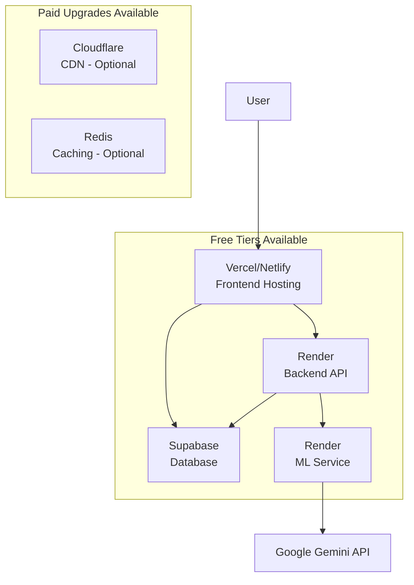
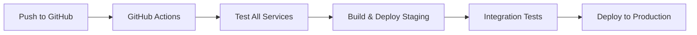

# Socratic Learning Platform - Hosting and Development Plan

## Project Overview
AI-powered adaptive learning platform with Socratic method, featuring React frontend, Node.js backend, Python ML service, and Supabase database.

## Recommended Hosting Architecture

### Free Tier Setup (Scalable to Paid)


### Service Breakdown
- **Frontend**: Vercel (free) or Netlify (free) - Static hosting with CDN
- **Backend**: Render (free tier: 750h/month) - Node.js API hosting
- **ML Service**: Render (free tier) - Python Flask hosting
- **Database**: Supabase (free tier: 500MB, 2GB bandwidth) - Managed PostgreSQL
- **AI**: Google Gemini (pay-per-use)

## Cost Analysis

### Free Tier Limits & Costs
| Service | Free Limits | Monthly Cost | Upgrade Trigger |
|---------|-------------|--------------|----------------|
| Vercel | 100GB bandwidth, 100 deploys | $0 | High traffic |
| Render | 750 hours, 512MB RAM × 2 services | $0 | Usage > 750h |
| Supabase | 500MB DB, 2GB bandwidth | $0 | Storage/traffic limits |
| Gemini | Pay-per-request | $10-50 | API usage |

### Scalability Path
- **Low Traffic (<100 users)**: All free
- **Medium Traffic (100-1000 users)**: $25-50/month (Supabase Pro + Render paid)
- **High Traffic (>1000 users)**: $100-200/month (full paid plans)

## Development Workflow

### Branch Strategy
```
main (production)
├── staging
│   ├── feature/auth-improvements
│   ├── feature/ui-enhancements
│   └── feature/ml-optimization
```

### CI/CD Pipeline


### Environment Setup
- **Development**: Local Docker Compose
- **Staging**: Automated deploy on PR to staging branch
- **Production**: Manual deploy after staging approval

## Security & Monitoring

### Security Measures
- HTTPS enforced on all services
- Environment variables for secrets
- Supabase RLS policies
- CORS configuration
- Rate limiting on API endpoints

### Monitoring Setup
- Vercel/Render built-in analytics
- Supabase dashboard monitoring
- Error tracking with Sentry (optional)
- Health check endpoints on all services

## Implementation Steps

1. **Setup Repositories & CI/CD**
   - Configure GitHub Actions for automated testing
   - Setup staging environment on Render
   - Configure production deployments

2. **Database Migration**
   - Deploy Supabase schema to production
   - Setup automated backups
   - Configure connection pooling

3. **Service Deployment**
   - Deploy frontend to Vercel
   - Deploy backend to Render
   - Deploy ML service to Render
   - Configure environment variables

4. **Domain & SSL**
   - Setup custom domain on Vercel
   - Configure SSL certificates
   - Update CORS settings

5. **Testing & Monitoring**
   - End-to-end testing in staging
   - Setup health checks
   - Configure error monitoring

## Migration Path

### From Development to Production
1. Create production Supabase project
2. Deploy services to hosting platforms
3. Configure production environment variables
4. Test all integrations
5. Setup monitoring and alerts

### Scaling Considerations
- Monitor usage metrics monthly
- Upgrade plans based on traffic growth
- Consider CDN for global distribution
- Implement caching for performance

## Risk Mitigation

### Rollback Strategy
- Keep previous Docker images tagged
- Database backups before schema changes
- Blue-green deployment capability
- Feature flags for gradual rollouts

### Backup Strategy
- Supabase automated daily backups
- Code repository as source of truth
- Environment configuration documented
- Disaster recovery plan tested quarterly

This plan provides a cost-effective, scalable hosting solution starting from free tiers with clear upgrade paths as the platform grows.